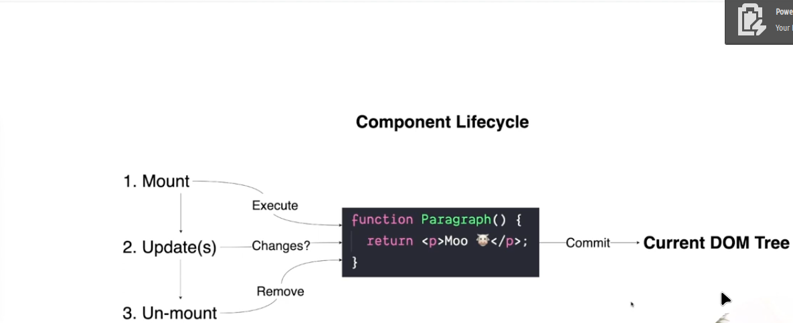

# REACT

React creates a virtual Dom that is used to update the real DOM in the browser. React element tree is the fake tree, it is simplistic representation of the real DOM which has a real DOM tree.

React has access to the React API and not the DOM API.
React uses JSX which is compiled to regular JavaScript and so that it can be understood and used by the DOM.

### DOM

When the browser receives the HTML it converts it to a tree like representton of the page known as the DOM. The browser then uses the DOM to paint/render the content of the page on screen. When we change or update the content of the page we use the DOM API.

Note that: the document, textContent, appenChild, setTimeout and others are all part of the DOM API

JavaScript enine and the rendering engine

### component lifecycle

Inialize --> Mount --> update --> Unmount

## Functional components

Functional components
Functional components are the building blocks of React. Think of them as being lego pieces that you can put together to build a large system, in this cas a website of web app.

- They are resusable

- They return JSX

### When returning things to the DOM from a functional component

- numbers get returned as text nodes
- empty array returns nothing
- booleans return nothing

## Events in React

React uses a synthetic event

- Events signal something that happens

### Component composition

### React Hooks

- useState Hook
- useRef
- useEffect
- useContext
